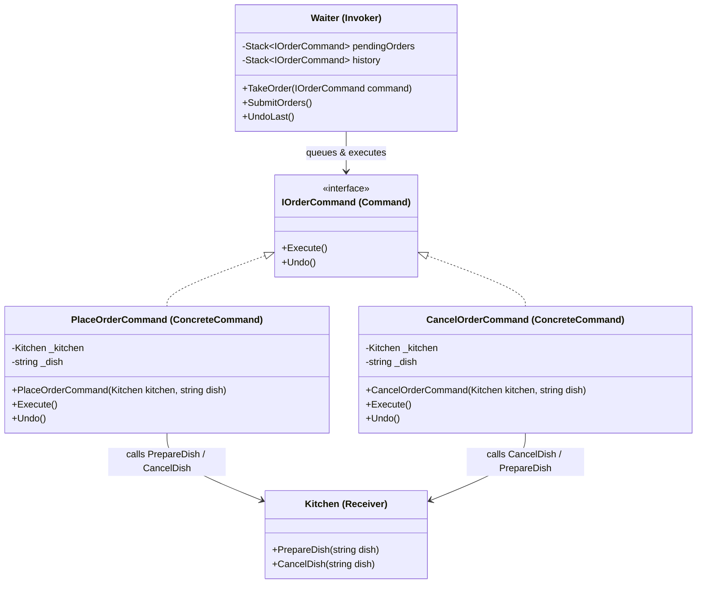

Command Pattern
Definition
Encapsulates a request as a standalone object, containing all the information needed to perform the action. This allows requests to be queued, logged, or undone/redone. It decouples the object that invokes the operation from the object that executes it.

UML Diagram

Use Cases

Undo/Redo in Text Editors — Every keystroke is a command; Ctrl+Z pops from history and calls Undo().
Restaurant Order Systems — As in this example — waiters queue orders and can cancel before submission.
Transaction Management — Database operations wrapped as commands can be committed or rolled back atomically.
Job Queues / Task Schedulers — Tasks are encapsulated as command objects and processed by workers asynchronously.
Remote Controls / Macro Recording — Each button press is a command; macros replay a sequence of recorded commands.
Game Action Systems — Player moves stored as commands allow replay, undo, and network synchronization.