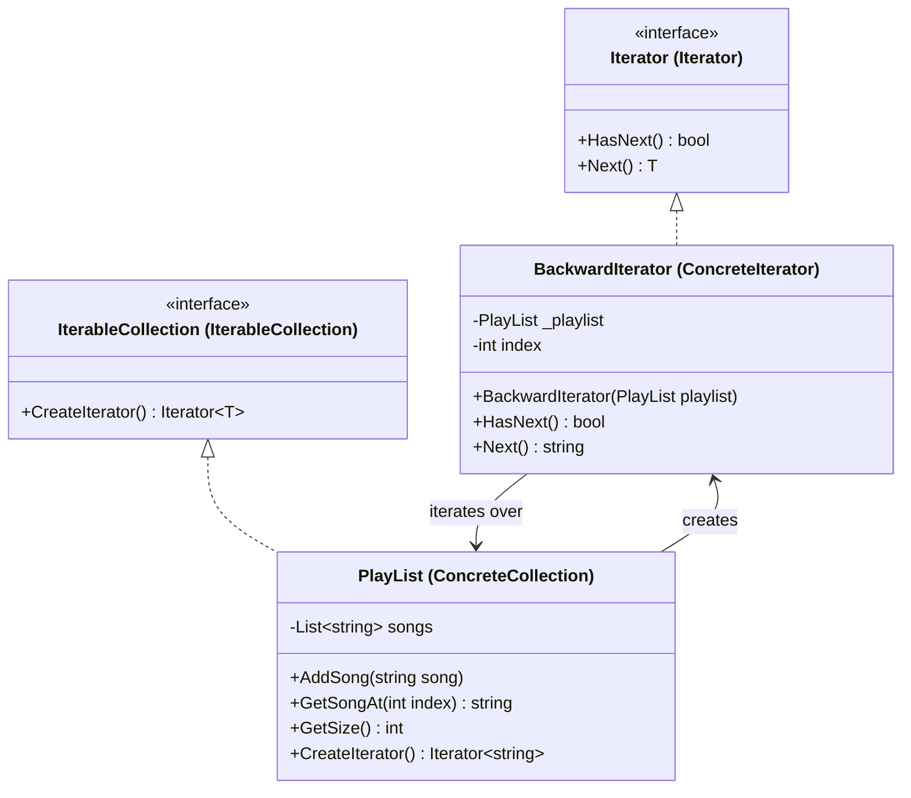

Iterator Pattern
Definition
Provides a way to sequentially access elements of a collection without exposing its underlying structure (list, stack, tree, etc.). It separates the traversal logic from the collection itself, allowing multiple different iterators over the same collection.

UML Diagram

Use Cases

Music Playlist Traversal — As in this example — forward, backward, shuffle iterators over the same playlist without modifying it.
File System Navigation — An iterator that traverses directories and files recursively without exposing the tree structure.
Database Cursor — ResultSet in JDBC/ADO.NET acts as an iterator over query rows, hiding the underlying fetch logic.
Social Media Feed — A paginated iterator fetches the next batch of posts transparently as the user scrolls.
Graph/Tree Traversal — BFS and DFS iterators over the same graph without modifying the graph class.
Log File Processing — Iterate line by line over a large log file without loading everything into memory.