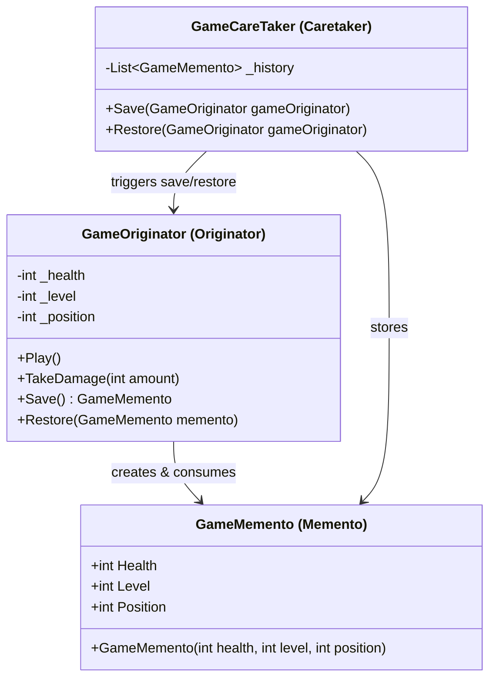

Memento Pattern
Definition
Allows capturing and storing an object's internal state as a snapshot so it can be restored later, without violating encapsulation. The object whose state is saved (Originator) is the only one that knows how to produce and consume the snapshot (Memento); the Caretaker stores and manages these snapshots.

UML Diagram

Use Cases

Game Save/Load System — As in this example — save player health, level, and position at checkpoints and restore on death.
Text Editor Undo — Each edit produces a Memento snapshot; Ctrl+Z restores the previous document state.
Transaction Rollback — A database transaction saves a before-image (Memento) and rolls back if the operation fails.
Wizard/Multi-step Forms — Store state at each step so the user can go back without losing previous entries.
Configuration Snapshots — Save the current system configuration before applying changes; restore if the new config fails.
Drawing/Design Tools — Save canvas state before each stroke; allow unlimited undo through stored Mementos.