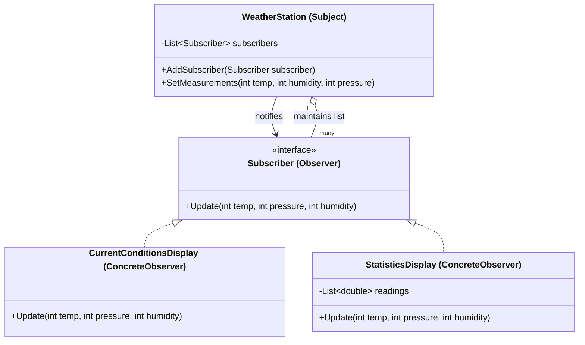

Observer Pattern
Definition
Defines a one-to-many dependency between objects so that when one object (Subject) changes its state, all its dependents (Observers) are automatically notified and updated. It promotes loose coupling — the subject knows nothing about its observers beyond the shared interface.

UML Diagram

Use Cases

Weather Station Displays — As in this example — multiple displays (current, average, forecast) all react to one data source.
Event Systems / UI Frameworks — Button click events notify all registered listeners (onClick handlers).
Stock Price Tickers — A market feed notifies all subscribed dashboards and alert services when a price changes.
Social Media Notifications — A post notifies all followers automatically when published.
Model-View in MVC — The model (subject) notifies views (observers) to re-render when data changes.
Logging & Monitoring — Multiple log handlers (file logger, console logger, remote logger) subscribe to the same application event stream.