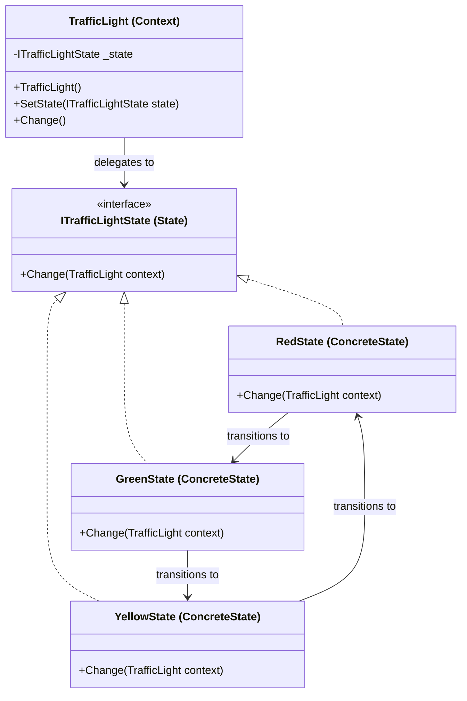

State Pattern
Definition
Allows an object to alter its behaviour when its internal state changes, appearing to change its class. Instead of large if/switch blocks, each state is encapsulated in its own class. The ConcreteState is responsible for deciding which state to transition to next.

UML Diagram

Use Cases

Traffic Light Controller — As in this example — each light color is a state that automatically transitions to the next.
Vending Machine — States like IdleState, HasMoneyState, DispensingState each handle button presses differently.
Order Lifecycle — An order transitions through Pending → Confirmed → Shipped → Delivered → Cancelled, each with different allowed actions.
Media Player — PlayingState, PausedState, StoppedState each respond differently to play/pause/stop button presses.
ATM Machine — NoCardState, HasCardState, AuthenticatedState, TransactionState manage the card interaction flow.
TCP Connection — States like Established, Listening, Closed each handle network events differently.