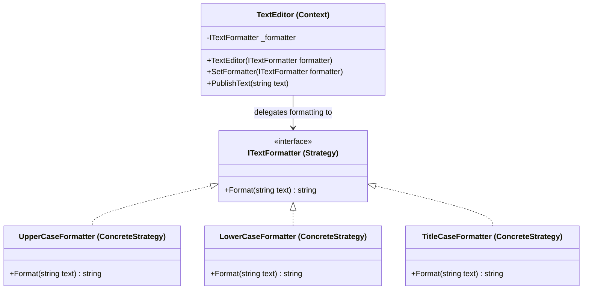

Strategy Pattern
Definition
Encapsulates a family of algorithms into separate classes and makes them interchangeable at runtime. The context delegates the work to a strategy object instead of implementing the algorithm directly, allowing the behaviour to be swapped without modifying the context class.

UML Diagram

Use Cases

Text Formatter — As in this example — swap between uppercase, lowercase, or title case at runtime without changing the editor.
Sorting Algorithms — A list class delegates sorting to a pluggable strategy (BubbleSort, QuickSort, MergeSort) chosen at runtime.
Payment Processing — A checkout system swaps between CreditCardStrategy, PayPalStrategy, or CryptoStrategy based on user choice.
Compression Tools — File archiver switches between ZipStrategy, GzipStrategy, or Bzip2Strategy depending on format selected.
Navigation Apps — Route planner swaps between WalkingStrategy, DrivingStrategy, and TransitStrategy based on user preference.
Discount/Pricing Rules — An e-commerce cart applies different discount strategies (seasonal, loyalty, coupon) swapped at checkout.