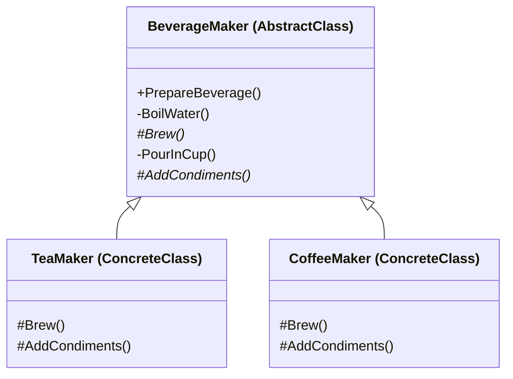

Template Method Pattern
Definition
Defines the skeleton of an algorithm in a base class, deferring some steps to subclasses. Subclasses can override specific steps without changing the overall structure of the algorithm. It enforces a fixed sequence of steps while allowing customization of individual steps.

UML Diagram

Use Cases

Beverage Maker — As in this example — the preparation sequence (boil, brew, pour, add condiments) is fixed; only brew and condiments vary per drink.
Data Import Pipelines — A base importer defines the steps (open file → parse → validate → save); subclasses handle CSV vs XML vs JSON parsing differently.
Report Generation — A base report class defines the flow (header → body → footer); subclasses render PDF vs HTML differently.
Game AI Turn Logic — A base AI turn defines the sequence (assess → decide → act); different enemy types override the decision step.
Build Systems — A base build process defines steps (compile → test → package → deploy); subclasses customize for different languages or targets.
HTTP Request Handlers — A base handler defines authenticate → authorize → process → respond; subclasses override the process step per endpoint.