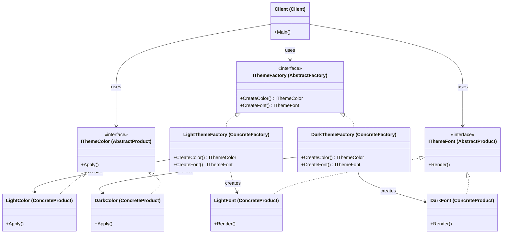

Abstract Factory Pattern
Definition
Provides an interface for creating families of related objects without specifying their concrete classes. It ensures that the related products (created by one factory) are always compatible with each other, preventing a mismatch between objects from different families.

UML Diagram

Use Cases

UI Theming Systems — As in this example — switching between Light and Dark themes guarantees colors and fonts always belong to the same theme family.
Cross-Platform UI Toolkits — Creating Windows-style vs Mac-style widgets (buttons, scrollbars, menus) through platform-specific factories.
Database Drivers — A MySQLFactory creates MySQL-compatible Connection, Command, and Reader objects; a PostgreSQLFactory creates PostgreSQL-compatible ones.
Game Environments — A ForestFactory creates forest-themed enemies, terrain, and music; a DesertFactory creates a desert set — ensuring visual consistency.
Cloud Provider SDKs — An AWSFactory produces AWS S3, EC2, and Lambda clients; an AzureFactory produces Azure equivalents — same interface, different implementations.