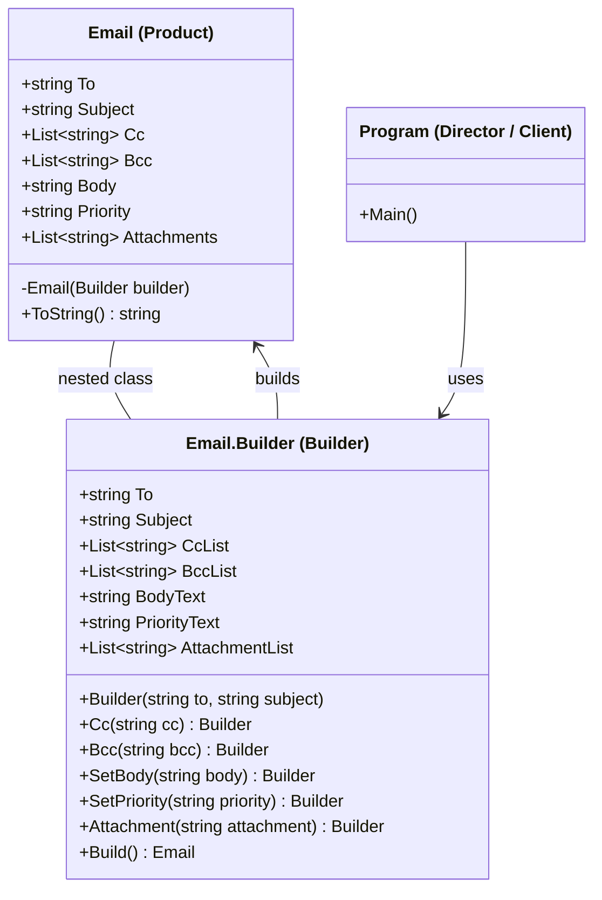

Builder Pattern
Definition
Separates the construction of a complex object from its representation, allowing the same construction process to create different configurations step by step. It solves the problem of having too many constructor parameters (telescoping constructor) and ensures an object is only created in a valid, fully configured state.

UML Diagram

Use Cases

Email/Message Builders — As in this example — constructing emails with optional CC, BCC, attachments, and priority without overloaded constructors.
HTTP Request Builders — Building requests with optional headers, query params, body, and auth — common in REST client libraries.
Query Builders — ORM libraries like Entity Framework use builders to compose SQL queries with optional WHERE, ORDER BY, LIMIT clauses.
Report Generation — Building PDF/HTML reports step by step — adding header, body sections, charts, and footers conditionally.
Pizza/Food Ordering Systems — Constructing a custom order (size, crust, toppings) where most fields are optional but the final product must be consistent.
Game Character Builders — Creating a character with optional armor, weapons, and skills while ensuring required stats are always set.