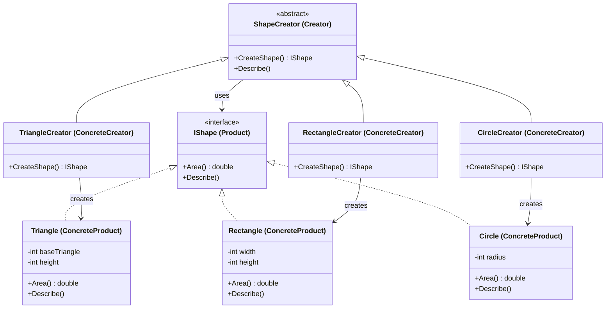

Factory Method Pattern
Definition
Defines an interface for creating an object in a superclass, but lets subclasses decide which class to instantiate. The creator delegates the responsibility of object creation to its subclasses, promoting loose coupling between the creator and the concrete products.

UML Diagram

Use Cases

UI Frameworks — Different OS platforms (Windows, Mac, Linux) create their own button/dialog implementations via subclasses.
Payment Gateways — A base payment processor defines the flow; subclasses like StripeCreator or PayPalCreator create the right payment object.
Document Exporters — A base exporter delegates to PdfCreator, WordCreator, or CsvCreator without changing the export pipeline.
Notification Systems — A base notifier lets subclasses like EmailCreator, SMSCreator, or PushCreator decide how the notification is built.
Shape/Drawing Tools — As in this example — a drawing framework allows adding new shapes without modifying existing creator logic.