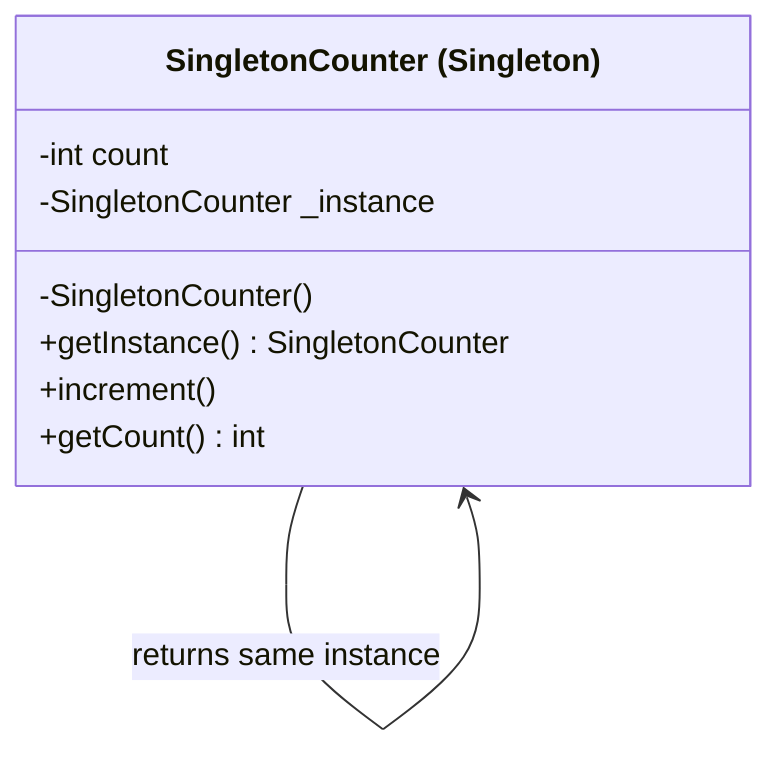

Singleton Pattern
Definition
Ensures that a class has only one instance throughout the application's lifetime, and provides a global access point to that instance. It prevents multiple instantiations by making the constructor private and controlling creation through a static method.

UML Diagram

Use Cases

Logger — A single logging instance shared across the entire application ensures all logs go to one place.
Configuration Manager — App settings loaded once and accessed globally without re-reading files.
Database Connection Pool — One pool instance manages all DB connections to avoid resource exhaustion.
Cache Manager — A single in-memory cache shared across services to avoid data duplication.
Thread Pool — One pool managing all worker threads to prevent overloading the system.