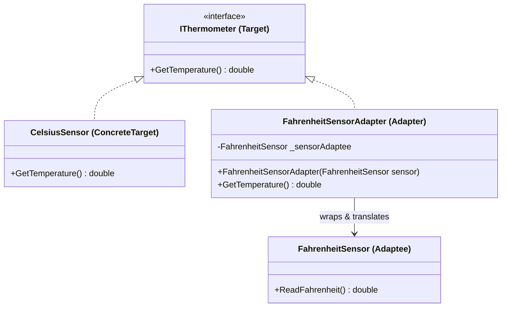

Adapter Pattern
Definition
Allows incompatible interfaces to work together by wrapping an existing class (Adaptee) with a new interface (Target). The Adapter translates calls from the Target interface into calls the Adaptee understands, acting as a bridge without modifying either class.

UML Diagram

Use Cases

Temperature Sensor Adapter — As in this example — wrapping a Fahrenheit sensor to expose a Celsius interface without changing either class.
Third-Party Library Integration — Adapting a legacy payment library's interface to your modern IPaymentGateway interface without rewriting it.
XML to JSON Adapter — Wrapping an XML-based data service to expose a JSON-compatible interface to the rest of the system.
Old API to New API Migration — An adapter bridges old method signatures to new ones during a gradual migration, keeping both versions functional.
Database Driver Adapters — Adapting different database drivers (MySQL, PostgreSQL, SQLite) to a single IDbConnection interface.
Media Format Adapters — Wrapping codec libraries with different interfaces behind a single unified IMediaPlayer interface.