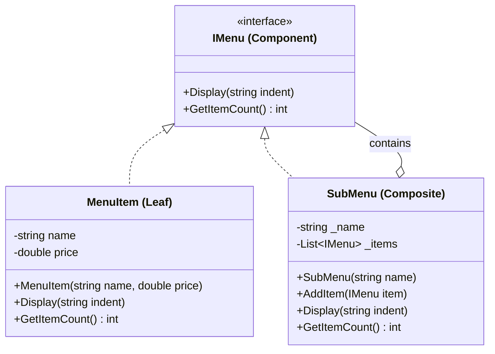

Composite Pattern
Definition
Provides a unified interface for both individual objects (Leaf) and compositions of objects (Composite). Clients treat a single object and a group of objects the same way. This creates a tree structure where composites can contain both leaves and other composites.

UML Diagram

Use Cases

Restaurant Menu System — As in this example — a menu contains individual items and sub-menus, all treated uniformly via Display().
File System — Files (Leaf) and Folders (Composite) share the same interface; getSize() on a folder recursively sums file sizes.
UI Component Trees — A Panel (Composite) contains Button, Label, or other Panel elements, all rendered via a single Draw() call.
Organization Hierarchy — An Employee (Leaf) and Department (Composite) share the same interface; getSalary() on a department totals all salaries.
Document Structure — A document contains sections, which contain paragraphs and images, all rendered through a single render() method.
Expression Trees — A math expression tree where Number is a leaf and BinaryOperation (+, -, *, /) is a composite — both implement evaluate().