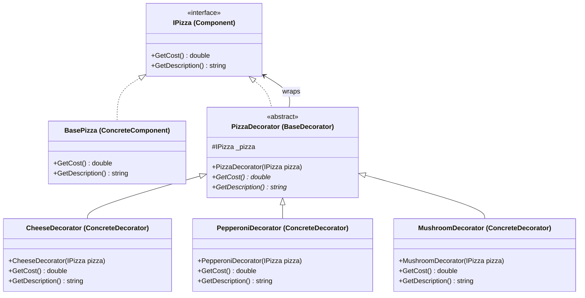

Decorator Pattern
Definition
Dynamically adds behaviour or responsibilities to an object by wrapping it in decorator objects, without modifying the original class or using inheritance. Decorators implement the same interface as the object they wrap, allowing them to be stacked in any combination.

UML Diagram

Use Cases

Pizza Topping System — As in this example — wrapping a base pizza with topping decorators, each adding cost and description.
I/O Streams — Java/C# stream decorators (BufferedStream, GZipStream, CryptoStream) wrap each other to add buffering, compression, or encryption.
Coffee Shop Orders — A plain coffee wrapped with Milk, Sugar, and WhipCream decorators — each adds to price and description.
Logging Middleware — Wrapping a service with a LoggingDecorator that logs before/after every method call without modifying the service.
UI Component Styling — Adding scroll bars, borders, or shadows to a base UI component by wrapping it in visual decorators.
HTTP Request/Response Pipeline — Middleware layers (auth, compression, caching, logging) wrap the core handler as decorators in a chain.