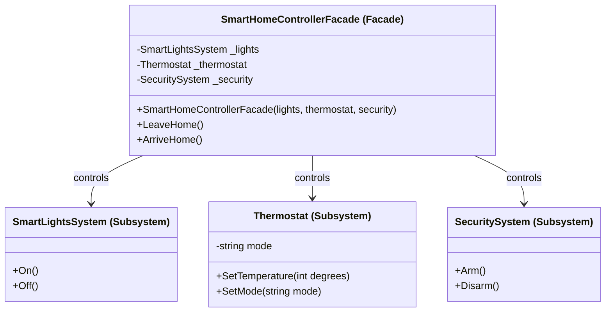

Facade Pattern
Definition
Provides a single simplified interface to a complex set of interfaces in a subsystem. The Facade shields the client from the internal complexity of multiple subsystems, making the system easier to use without reducing the flexibility of the subsystems themselves.

UML Diagram

Use Cases

Smart Home Controller — As in this example — one facade coordinates lights, thermostat, and security with simple LeaveHome() / ArriveHome() calls.
Computer Startup — A Computer facade's Start() method internally coordinates CPU, RAM, HDD, GPU initialization without the user knowing.
E-Commerce Checkout — A CheckoutFacade coordinates inventory check, payment processing, order creation, and notification in one call.
Video Encoding — A facade wraps audio decoding, video decoding, compression, and muxing subsystems behind a single Convert(input, format) call.
Hotel Booking System — A HotelFacade coordinates room availability, billing, housekeeping, and key card systems through simple CheckIn() / CheckOut() methods.
API Gateway — Acts as a facade over multiple microservices, presenting a unified endpoint to clients while internally routing to the right service.