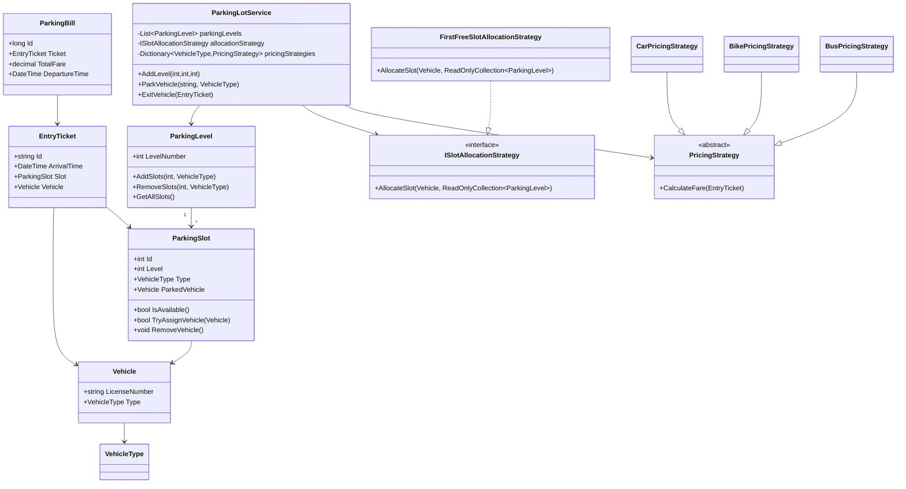

# Parking Lot Low Level Design (LLD)

## Overview

This project implements a scalable and extensible Parking Lot System using Object-Oriented Design principles and common design patterns.

The design focuses on:

* Clean separation of concerns
* Strategy Pattern for extensibility
* Thread-safe parking slot allocation
* Proper domain modeling
* Dependency Injection friendly architecture
* Encapsulation and concurrency awareness

---

# Features

* Multiple parking levels
* Multiple vehicle types

  * Car
  * Bike
  * Bus
* Dynamic slot allocation
* Parking entry ticket generation
* Parking bill generation
* Pricing strategy support
* Allocation strategy support
* Thread-safe slot assignment

---

# Design Principles Used

## SOLID Principles

### Single Responsibility Principle (SRP)

Each class has a focused responsibility.

Examples:

* `ParkingSlot` manages occupancy state
* `PricingStrategy` calculates fare
* `ParkingLotService` orchestrates parking workflow

---

### Open Closed Principle (OCP)

New pricing or allocation strategies can be added without modifying existing logic.

Examples:

* `CarPricingStrategy`
* `BikePricingStrategy`
* `BusPricingStrategy`

---

### Dependency Inversion Principle (DIP)

High-level modules depend on abstractions.

Examples:

* `ISlotAllocationStrategy`
* `PricingStrategy`

---

# Design Patterns Used

## Strategy Pattern

Used for:

* Slot allocation
* Fare calculation

### Allocation Strategy

```text
ISlotAllocationStrategy
    -> FirstFreeSlotAllocationStrategy
```

### Pricing Strategy

```text
PricingStrategy
    -> CarPricingStrategy
    -> BikePricingStrategy
    -> BusPricingStrategy
```

---

# Core Domain Models

## Vehicle

Represents a vehicle entering the parking lot.

Properties:

* LicenseNumber
* VehicleType

---

## ParkingSlot

Represents an individual parking slot.

Responsibilities:

* Assign vehicle
* Remove vehicle
* Thread-safe occupancy handling

---

## ParkingLevel

Represents a parking floor containing multiple slots.

Responsibilities:

* Add slots
* Remove slots
* Expose readonly slot collection

---

## EntryTicket

Generated when a vehicle enters the parking lot.

Contains:

* Vehicle
* Slot
* Arrival time

---

## ParkingBill

Generated when a vehicle exits the parking lot.

Contains:

* Entry ticket
* Total fare
* Departure time

---

# Thread Safety

Thread safety is implemented at parking slot level using object locking.

Example:

```csharp
lock (_slotLock)
{
    if (ParkedVehicle != null)
        return false;

    ParkedVehicle = vehicle;
}
```

This prevents multiple vehicles from occupying the same slot simultaneously.

---

# Parking Flow

## Vehicle Entry

1. Vehicle arrives
2. Allocation strategy searches for available slot
3. Slot attempts thread-safe assignment
4. Entry ticket generated

---

## Vehicle Exit

1. Vehicle exits using entry ticket
2. Slot becomes free
3. Pricing strategy calculates fare
4. Parking bill generated

---

# Extensibility

The design supports easy extension.

## Add New Vehicle Type

1. Add enum value
2. Create pricing strategy
3. Add slots

---

## Add New Allocation Strategy

Example:

* NearestSlotStrategy
* RandomSlotStrategy
* VIPAllocationStrategy

No existing code modification required.

---

# Current Limitations

This implementation intentionally keeps scope focused on core LLD concepts.

Not implemented:

* Database persistence
* Distributed locking
* Payment gateway integration
* Reservation system
* Active ticket repository
* Analytics/dashboard
* Dynamic pricing
* Slot reservation

---

# Future Improvements

* Introduce `ParkingLot` aggregate root entity
* Add repository layer
* Add payment service
* Add event-driven notifications
* Introduce reservation system
* Add optimistic locking
* Add Redis/distributed locking
* Add admin dashboard

---

# Mermaid Class Diagram



---

# Tech Stack

* Language: C#
* Framework Style: Dependency Injection Friendly
* Design Style: Object-Oriented Design (OOD)

---

# Learning Goals

This project was built to practice:

* Low Level Design (LLD)
* Object-Oriented Design
* SOLID principles
* Strategy Pattern
* Concurrency handling
* Clean Architecture concepts
