# ResourceMindAI — System Design

> **Project & Resource Management (PRM) Tool**
> Console-based client-server application with REST APIs and LLM-powered AI features.

---

## Table of Contents

1. [Class Diagrams](#class-diagrams)
   - [Domain Model — Core Entities](#domain-model--core-entities)
   - [Service Layer](#service-layer)
   - [Controller / API Layer](#controller--api-layer)
   - [AI Module](#ai-module)
2. [Sequence Diagrams](#sequence-diagrams)
   - [Authentication Flows](#authentication-flows)
   - [Admin Flows](#admin-flows)
   - [Manager Flows](#manager-flows)
   - [Employee Flows](#employee-flows)
   - [Background Scheduler](#background-scheduler)
   - [AI Flows](#ai-flows)

---

## Class Diagrams

### Domain Model — Core Entities

These are the primary data entities persisted in the database. Relationships enforce the business rules defined in the BRD.

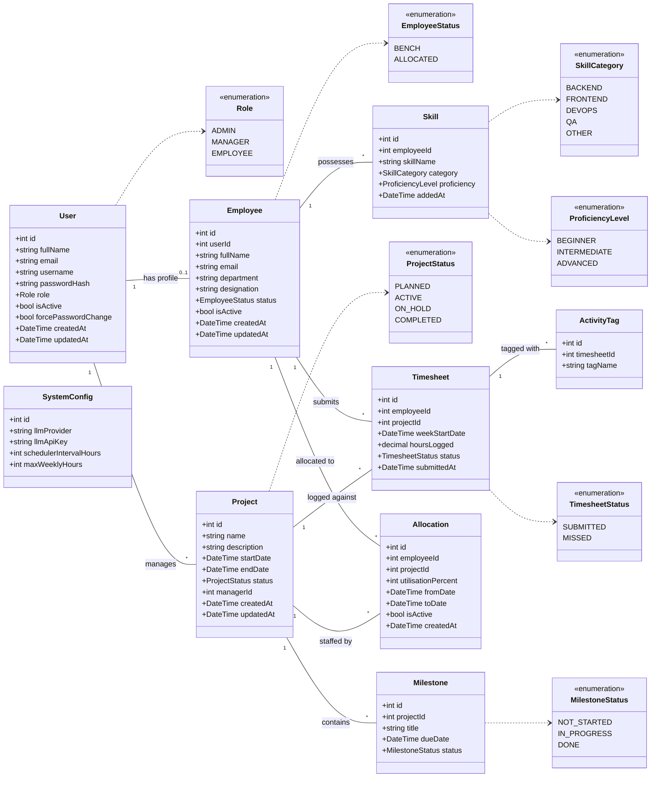
```mermaid
classDiagram
    direction LR

    class User {
        +int id
        +string fullName
        +string email
        +string username
        +string passwordHash
        +Role role
        +bool isActive
        +bool forcePasswordChange
        +DateTime createdAt
        +DateTime updatedAt
    }

    class Role {
        <<enumeration>>
        ADMIN
        MANAGER
        EMPLOYEE
    }

    class Employee {
        +int id
        +int userId
        +string fullName
        +string email
        +string department
        +string designation
        +EmployeeStatus status
        +bool isActive
        +DateTime createdAt
        +DateTime updatedAt
    }

    class EmployeeStatus {
        <<enumeration>>
        BENCH
        ALLOCATED
    }

    class Skill {
        +int id
        +int employeeId
        +string skillName
        +SkillCategory category
        +ProficiencyLevel proficiency
        +DateTime addedAt
    }

    class SkillCategory {
        <<enumeration>>
        BACKEND
        FRONTEND
        DEVOPS
        QA
        OTHER
    }

    class ProficiencyLevel {
        <<enumeration>>
        BEGINNER
        INTERMEDIATE
        ADVANCED
    }

    class Project {
        +int id
        +string name
        +string description
        +DateTime startDate
        +DateTime endDate
        +ProjectStatus status
        +int managerId
        +DateTime createdAt
        +DateTime updatedAt
    }

    class ProjectStatus {
        <<enumeration>>
        PLANNED
        ACTIVE
        ON_HOLD
        COMPLETED
    }

    class Milestone {
        +int id
        +int projectId
        +string title
        +DateTime dueDate
        +MilestoneStatus status
    }

    class MilestoneStatus {
        <<enumeration>>
        NOT_STARTED
        IN_PROGRESS
        DONE
    }

    class Allocation {
        +int id
        +int employeeId
        +int projectId
        +int utilisationPercent
        +DateTime fromDate
        +DateTime toDate
        +bool isActive
        +DateTime createdAt
    }

    class Timesheet {
        +int id
        +int employeeId
        +int projectId
        +DateTime weekStartDate
        +decimal hoursLogged
        +TimesheetStatus status
        +DateTime submittedAt
    }

    class TimesheetStatus {
        <<enumeration>>
        SUBMITTED
        MISSED
    }

    class ActivityTag {
        +int id
        +int timesheetId
        +string tagName
    }

    class SystemConfig {
        +int id
        +string llmProvider
        +string llmApiKey
        +int schedulerIntervalHours
        +int maxWeeklyHours
    }

    User "1" -- "0..1" Employee : has profile
    User "1" -- "*" Project : manages
    Employee "1" -- "*" Skill : possesses
    Employee "1" -- "*" Allocation : allocated to
    Employee "1" -- "*" Timesheet : submits
    Project "1" -- "*" Milestone : contains
    Project "1" -- "*" Allocation : staffed by
    Project "1" -- "*" Timesheet : logged against
    Timesheet "1" -- "*" ActivityTag : tagged with

    User ..> Role
    Employee ..> EmployeeStatus
    Skill ..> SkillCategory
    Skill ..> ProficiencyLevel
    Project ..> ProjectStatus
    Milestone ..> MilestoneStatus
    Timesheet ..> TimesheetStatus
```

---

### Service Layer

The service layer encapsulates all business logic. Each service maps to a functional area of the BRD.

```mermaid
classDiagram
    direction TB

    class IAuthService {
        <<interface>>
        +login(username, password) AuthResponse
        +signUp(signUpRequest) User
        +changePassword(userId, newPassword) void
        +validateToken(token) TokenPayload
    }

    class IUserService {
        <<interface>>
        +createUser(createUserRequest) User
        +getAllUsers() List~User~
        +getUserById(id) User
        +getUserByUsername(username) User
        +resetPassword(userId, tempPassword) void
        +deactivateUser(userId) void
        +reactivateUser(userId) void
    }

    class IEmployeeService {
        <<interface>>
        +addEmployee(addEmployeeRequest) Employee
        +getAllEmployees(filter?) List~Employee~
        +getEmployeeById(id) Employee
        +updateEmployee(id, updateRequest) Employee
        +deactivateEmployee(id) void
        +getEmployeeDetails(id) EmployeeDetailDTO
    }

    class ISkillService {
        <<interface>>
        +getSkillsByEmployee(employeeId) List~Skill~
        +addSkill(employeeId, skillRequest) Skill
        +updateProficiency(skillId, level) Skill
        +removeSkill(skillId) void
    }

    class IProjectService {
        <<interface>>
        +createProject(projectRequest) Project
        +getAllProjects() List~Project~
        +getProjectsByManager(managerId) List~Project~
        +updateProject(id, updateRequest) Project
        +getProjectDetail(id) ProjectDetailDTO
    }

    class IMilestoneService {
        <<interface>>
        +getMilestonesByProject(projectId) List~Milestone~
        +addMilestone(projectId, milestoneRequest) Milestone
        +updateMilestoneStatus(milestoneId, status) Milestone
    }

    class IAllocationService {
        <<interface>>
        +allocateResource(allocationRequest) Allocation
        +getAllAllocations(filter?) List~AllocationDTO~
        +getActiveByEmployee(employeeId) List~Allocation~
        +getActiveByProject(projectId) List~Allocation~
        +endAllocation(allocationId) Allocation
        +validateUtilisation(employeeId, percent, from, to) bool
    }

    class ITimesheetService {
        <<interface>>
        +submitTimesheet(timesheetRequest) Timesheet
        +getTimesheetsByEmployee(employeeId, weekStart?) List~Timesheet~
        +getTimesheetsByProject(projectId, weekStart?) List~Timesheet~
        +getTeamTimesheets(managerId, weekStart) List~TimesheetDTO~
        +getTimesheetHistory(employeeId) List~Timesheet~
    }

    class ISchedulerService {
        <<interface>>
        +runUtilisationUpdate() void
        +runHealthFlagging() void
        +computeProjectHealth(projectId) HealthStatus
    }

    class IAIService {
        <<interface>>
        +skillMatch(requirement, projectId) List~SkillMatchResult~
        +generateRiskSummary(projectId) string
    }

    class ISystemConfigService {
        <<interface>>
        +getConfig() SystemConfig
        +updateLLMApiKey(key) void
        +updateLLMProvider(provider) void
        +updateSchedulerInterval(hours) void
        +updateMaxWeeklyHours(hours) void
    }

    IAllocationService ..> IEmployeeService : validates capacity
    IAllocationService ..> IProjectService : validates project status
    IAIService ..> IEmployeeService : fetches candidates
    IAIService ..> IAllocationService : checks availability
    IAIService ..> ITimesheetService : reads activity tags
    IAIService ..> IMilestoneService : reads milestone data
    IAIService ..> ISystemConfigService : reads LLM config
    ISchedulerService ..> IAllocationService : recomputes utilisation
    ISchedulerService ..> IMilestoneService : checks overdue milestones
    ISchedulerService ..> ITimesheetService : detects missed timesheets
```

---

### Controller / API Layer

REST API controllers that expose endpoints consumed by the console client.

```mermaid
classDiagram
    direction TB

    class AuthController {
        +POST /api/auth/login
        +POST /api/auth/signup
        +POST /api/auth/change-password
    }

    class UserController {
        +POST /api/users
        +GET /api/users
        +GET /api/users/:id
        +PUT /api/users/:id/reset-password
        +PUT /api/users/:id/deactivate
        +PUT /api/users/:id/reactivate
    }

    class EmployeeController {
        +POST /api/employees
        +GET /api/employees
        +GET /api/employees/:id
        +PUT /api/employees/:id
        +PUT /api/employees/:id/deactivate
        +GET /api/employees/:id/details
    }

    class SkillController {
        +GET /api/employees/:id/skills
        +POST /api/employees/:id/skills
        +PUT /api/skills/:id
        +DELETE /api/skills/:id
    }

    class ProjectController {
        +POST /api/projects
        +GET /api/projects
        +GET /api/projects/manager/:managerId
        +PUT /api/projects/:id
        +GET /api/projects/:id/details
    }

    class MilestoneController {
        +GET /api/projects/:id/milestones
        +POST /api/projects/:id/milestones
        +PUT /api/milestones/:id/status
    }

    class AllocationController {
        +POST /api/allocations
        +GET /api/allocations
        +GET /api/allocations/employee/:id
        +GET /api/allocations/project/:id
        +PUT /api/allocations/:id/end
        +POST /api/allocations/validate
    }

    class TimesheetController {
        +POST /api/timesheets
        +GET /api/timesheets/employee/:id
        +GET /api/timesheets/project/:id
        +GET /api/timesheets/team/:managerId
        +GET /api/timesheets/history/:employeeId
    }

    class AIController {
        +POST /api/ai/skill-match
        +POST /api/ai/risk-summary
    }

    class SystemConfigController {
        +GET /api/config
        +PUT /api/config/llm-key
        +PUT /api/config/llm-provider
        +PUT /api/config/scheduler-interval
        +PUT /api/config/max-weekly-hours
    }

    AuthController --> IAuthService
    UserController --> IUserService
    EmployeeController --> IEmployeeService
    SkillController --> ISkillService
    ProjectController --> IProjectService
    MilestoneController --> IMilestoneService
    AllocationController --> IAllocationService
    TimesheetController --> ITimesheetService
    AIController --> IAIService
    SystemConfigController --> ISystemConfigService
```

---

### AI Module

Internal architecture of the AI subsystem — how data flows from raw system data to LLM-generated responses.

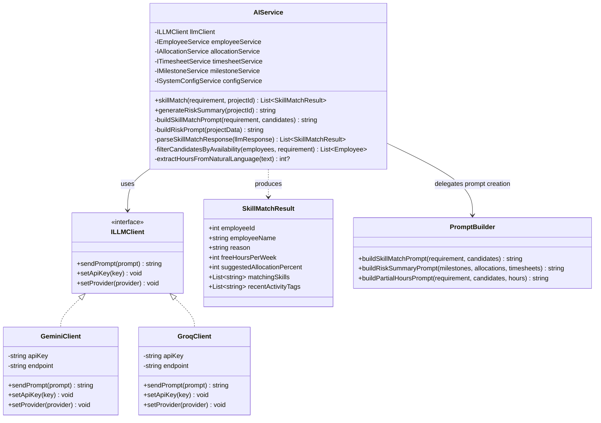
```mermaid
classDiagram
    direction TB

    class AIService {
        -ILLMClient llmClient
        -IEmployeeService employeeService
        -IAllocationService allocationService
        -ITimesheetService timesheetService
        -IMilestoneService milestoneService
        -ISystemConfigService configService
        +skillMatch(requirement, projectId) List~SkillMatchResult~
        +generateRiskSummary(projectId) string
        -buildSkillMatchPrompt(requirement, candidates) string
        -buildRiskPrompt(projectData) string
        -parseSkillMatchResponse(llmResponse) List~SkillMatchResult~
        -filterCandidatesByAvailability(employees, requirement) List~Employee~
        -extractHoursFromNaturalLanguage(text) int?
    }

    class ILLMClient {
        <<interface>>
        +sendPrompt(prompt) string
        +setApiKey(key) void
        +setProvider(provider) void
    }

    class GeminiClient {
        -string apiKey
        -string endpoint
        +sendPrompt(prompt) string
        +setApiKey(key) void
        +setProvider(provider) void
    }

    class GroqClient {
        -string apiKey
        -string endpoint
        +sendPrompt(prompt) string
        +setApiKey(key) void
        +setProvider(provider) void
    }

    class SkillMatchResult {
        +int employeeId
        +string employeeName
        +string reason
        +int freeHoursPerWeek
        +int suggestedAllocationPercent
        +List~string~ matchingSkills
        +List~string~ recentActivityTags
    }

    class PromptBuilder {
        +buildSkillMatchPrompt(requirement, candidates) string
        +buildRiskSummaryPrompt(milestones, allocations, timesheets) string
        +buildPartialHoursPrompt(requirement, candidates, hours) string
    }

    ILLMClient <|.. GeminiClient
    ILLMClient <|.. GroqClient
    AIService --> ILLMClient : uses
    AIService --> PromptBuilder : delegates prompt creation
    AIService ..> SkillMatchResult : produces
```

---

## Sequence Diagrams

### Authentication Flows

#### Login — Standard Flow

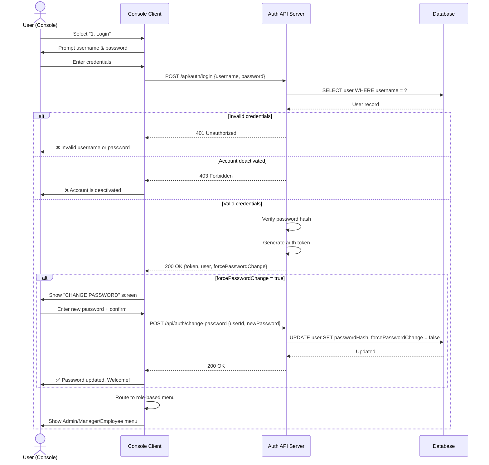
```mermaid
sequenceDiagram
    actor U as User (Console)
    participant C as Console Client
    participant S as Auth API Server
    participant DB as Database

    U->>C: Select "1. Login"
    C->>U: Prompt username & password
    U->>C: Enter credentials

    C->>S: POST /api/auth/login {username, password}
    S->>DB: SELECT user WHERE username = ?
    DB-->>S: User record

    alt Invalid credentials
        S-->>C: 401 Unauthorized
        C->>U: ❌ Invalid username or password
    else Account deactivated
        S-->>C: 403 Forbidden
        C->>U: ❌ Account is deactivated
    else Valid credentials
        S->>S: Verify password hash
        S->>S: Generate auth token
        S-->>C: 200 OK {token, user, forcePasswordChange}

        alt forcePasswordChange = true
            C->>U: Show "CHANGE PASSWORD" screen
            U->>C: Enter new password + confirm
            C->>S: POST /api/auth/change-password {userId, newPassword}
            S->>DB: UPDATE user SET passwordHash, forcePasswordChange = false
            DB-->>S: Updated
            S-->>C: 200 OK
            C->>U: ✅ Password updated. Welcome!
        end

        C->>C: Route to role-based menu
        C->>U: Show Admin/Manager/Employee menu
    end
```

#### Sign Up — Self-Registration

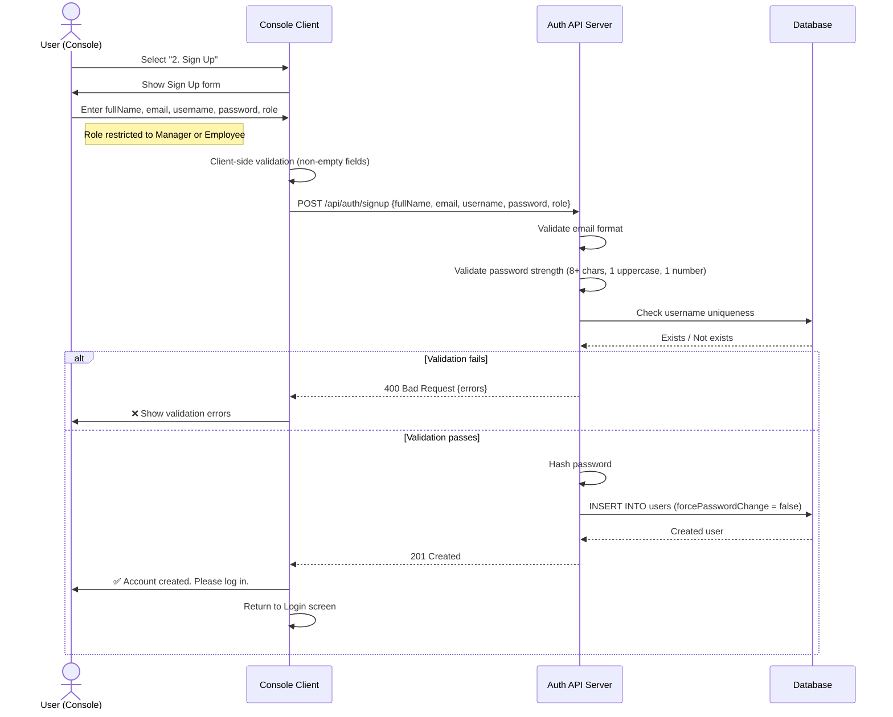
```mermaid
sequenceDiagram
    actor U as User (Console)
    participant C as Console Client
    participant S as Auth API Server
    participant DB as Database

    U->>C: Select "2. Sign Up"
    C->>U: Show Sign Up form

    U->>C: Enter fullName, email, username, password, role
    Note right of U: Role restricted to Manager or Employee

    C->>C: Client-side validation (non-empty fields)
    C->>S: POST /api/auth/signup {fullName, email, username, password, role}

    S->>S: Validate email format
    S->>S: Validate password strength (8+ chars, 1 uppercase, 1 number)
    S->>DB: Check username uniqueness
    DB-->>S: Exists / Not exists

    alt Validation fails
        S-->>C: 400 Bad Request {errors}
        C->>U: ❌ Show validation errors
    else Validation passes
        S->>S: Hash password
        S->>DB: INSERT INTO users (forcePasswordChange = false)
        DB-->>S: Created user
        S-->>C: 201 Created
        C->>U: ✅ Account created. Please log in.
        C->>C: Return to Login screen
    end
```

---

### Admin Flows

#### Create User Account (Admin)

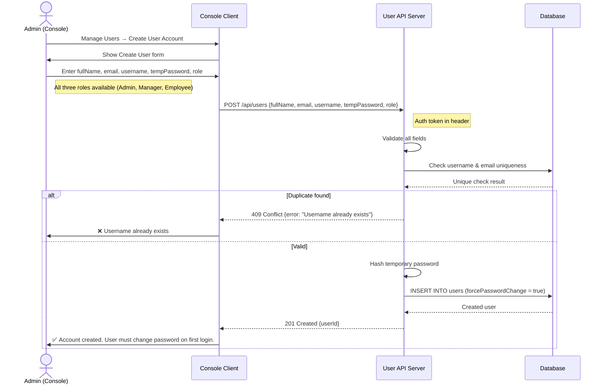
```mermaid
sequenceDiagram
    actor A as Admin (Console)
    participant C as Console Client
    participant S as User API Server
    participant DB as Database

    A->>C: Manage Users → Create User Account
    C->>A: Show Create User form

    A->>C: Enter fullName, email, username, tempPassword, role
    Note right of A: All three roles available (Admin, Manager, Employee)

    C->>S: POST /api/users {fullName, email, username, tempPassword, role}
    Note right of S: Auth token in header

    S->>S: Validate all fields
    S->>DB: Check username & email uniqueness
    DB-->>S: Unique check result

    alt Duplicate found
        S-->>C: 409 Conflict {error: "Username already exists"}
        C->>A: ❌ Username already exists
    else Valid
        S->>S: Hash temporary password
        S->>DB: INSERT INTO users (forcePasswordChange = true)
        DB-->>S: Created user
        S-->>C: 201 Created {userId}
        C->>A: ✅ Account created. User must change password on first login.
    end
```

#### Add Employee & Link to User

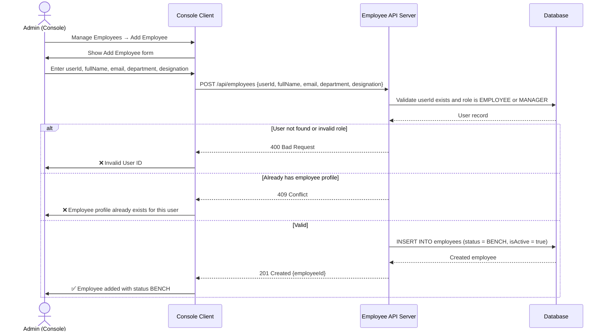
```mermaid
sequenceDiagram
    actor A as Admin (Console)
    participant C as Console Client
    participant S as Employee API Server
    participant DB as Database

    A->>C: Manage Employees → Add Employee
    C->>A: Show Add Employee form

    A->>C: Enter userId, fullName, email, department, designation

    C->>S: POST /api/employees {userId, fullName, email, department, designation}

    S->>DB: Validate userId exists and role is EMPLOYEE or MANAGER
    DB-->>S: User record

    alt User not found or invalid role
        S-->>C: 400 Bad Request
        C->>A: ❌ Invalid User ID
    else Already has employee profile
        S-->>C: 409 Conflict
        C->>A: ❌ Employee profile already exists for this user
    else Valid
        S->>DB: INSERT INTO employees (status = BENCH, isActive = true)
        DB-->>S: Created employee
        S-->>C: 201 Created {employeeId}
        C->>A: ✅ Employee added with status BENCH
    end
```

#### Deactivate Employee

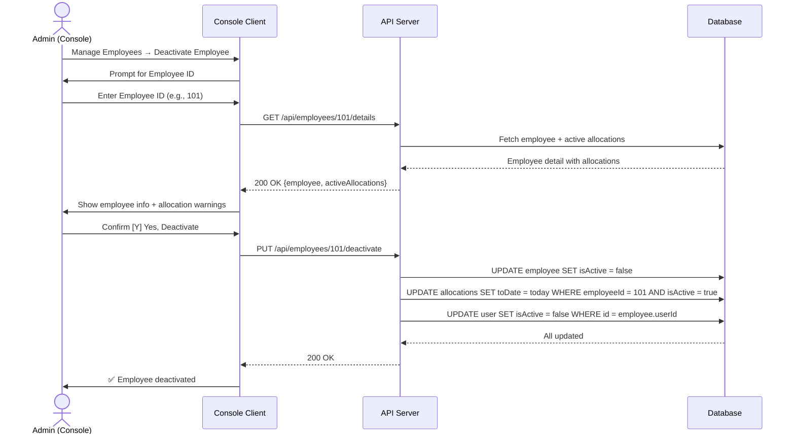
```mermaid
sequenceDiagram
    actor A as Admin (Console)
    participant C as Console Client
    participant S as API Server
    participant DB as Database

    A->>C: Manage Employees → Deactivate Employee
    C->>A: Prompt for Employee ID
    A->>C: Enter Employee ID (e.g., 101)

    C->>S: GET /api/employees/101/details
    S->>DB: Fetch employee + active allocations
    DB-->>S: Employee detail with allocations

    S-->>C: 200 OK {employee, activeAllocations}
    C->>A: Show employee info + allocation warnings

    A->>C: Confirm [Y] Yes, Deactivate

    C->>S: PUT /api/employees/101/deactivate

    S->>DB: UPDATE employee SET isActive = false
    S->>DB: UPDATE allocations SET toDate = today WHERE employeeId = 101 AND isActive = true
    S->>DB: UPDATE user SET isActive = false WHERE id = employee.userId
    DB-->>S: All updated

    S-->>C: 200 OK
    C->>A: ✅ Employee deactivated
```

#### Manage Employee Skills

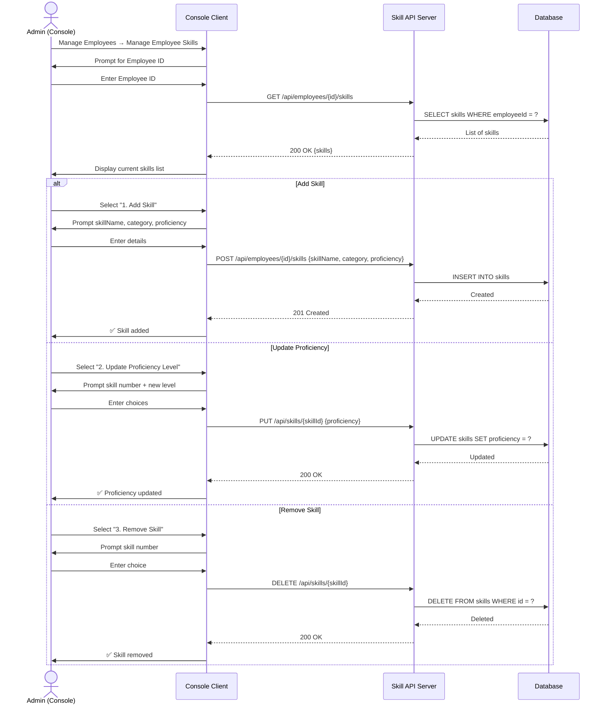
```mermaid
sequenceDiagram
    actor A as Admin (Console)
    participant C as Console Client
    participant S as Skill API Server
    participant DB as Database

    A->>C: Manage Employees → Manage Employee Skills
    C->>A: Prompt for Employee ID
    A->>C: Enter Employee ID

    C->>S: GET /api/employees/{id}/skills
    S->>DB: SELECT skills WHERE employeeId = ?
    DB-->>S: List of skills
    S-->>C: 200 OK {skills}
    C->>A: Display current skills list

    alt Add Skill
        A->>C: Select "1. Add Skill"
        C->>A: Prompt skillName, category, proficiency
        A->>C: Enter details
        C->>S: POST /api/employees/{id}/skills {skillName, category, proficiency}
        S->>DB: INSERT INTO skills
        DB-->>S: Created
        S-->>C: 201 Created
        C->>A: ✅ Skill added
    else Update Proficiency
        A->>C: Select "2. Update Proficiency Level"
        C->>A: Prompt skill number + new level
        A->>C: Enter choices
        C->>S: PUT /api/skills/{skillId} {proficiency}
        S->>DB: UPDATE skills SET proficiency = ?
        DB-->>S: Updated
        S-->>C: 200 OK
        C->>A: ✅ Proficiency updated
    else Remove Skill
        A->>C: Select "3. Remove Skill"
        C->>A: Prompt skill number
        A->>C: Enter choice
        C->>S: DELETE /api/skills/{skillId}
        S->>DB: DELETE FROM skills WHERE id = ?
        DB-->>S: Deleted
        S-->>C: 200 OK
        C->>A: ✅ Skill removed
    end
```

#### Create Project & Manage Milestones

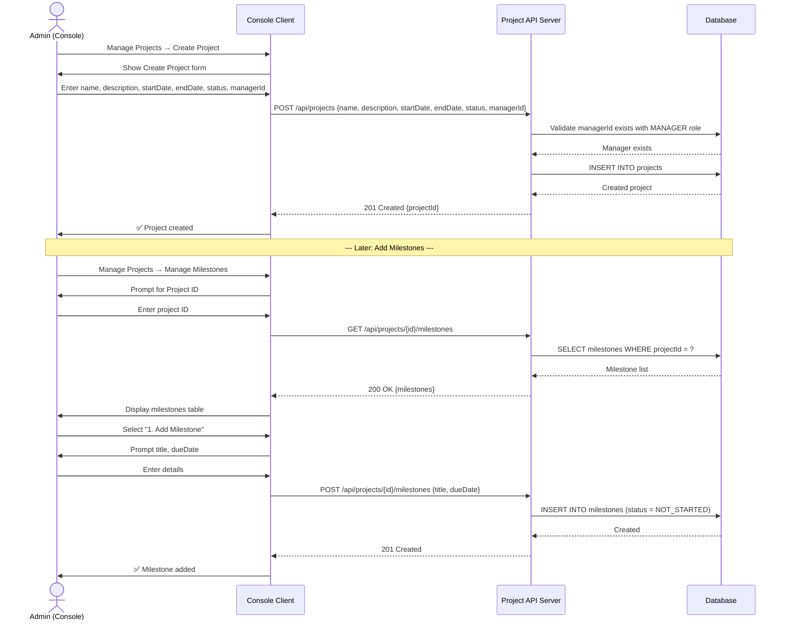
```mermaid
sequenceDiagram
    actor A as Admin (Console)
    participant C as Console Client
    participant S as Project API Server
    participant DB as Database

    A->>C: Manage Projects → Create Project
    C->>A: Show Create Project form
    A->>C: Enter name, description, startDate, endDate, status, managerId

    C->>S: POST /api/projects {name, description, startDate, endDate, status, managerId}
    S->>DB: Validate managerId exists with MANAGER role
    DB-->>S: Manager exists
    S->>DB: INSERT INTO projects
    DB-->>S: Created project
    S-->>C: 201 Created {projectId}
    C->>A: ✅ Project created

    Note over A,DB: --- Later: Add Milestones ---

    A->>C: Manage Projects → Manage Milestones
    C->>A: Prompt for Project ID
    A->>C: Enter project ID

    C->>S: GET /api/projects/{id}/milestones
    S->>DB: SELECT milestones WHERE projectId = ?
    DB-->>S: Milestone list
    S-->>C: 200 OK {milestones}
    C->>A: Display milestones table

    A->>C: Select "1. Add Milestone"
    C->>A: Prompt title, dueDate
    A->>C: Enter details

    C->>S: POST /api/projects/{id}/milestones {title, dueDate}
    S->>DB: INSERT INTO milestones (status = NOT_STARTED)
    DB-->>S: Created
    S-->>C: 201 Created
    C->>A: ✅ Milestone added
```

---

### Manager Flows

#### Resource Dashboard — Drill Into Employee

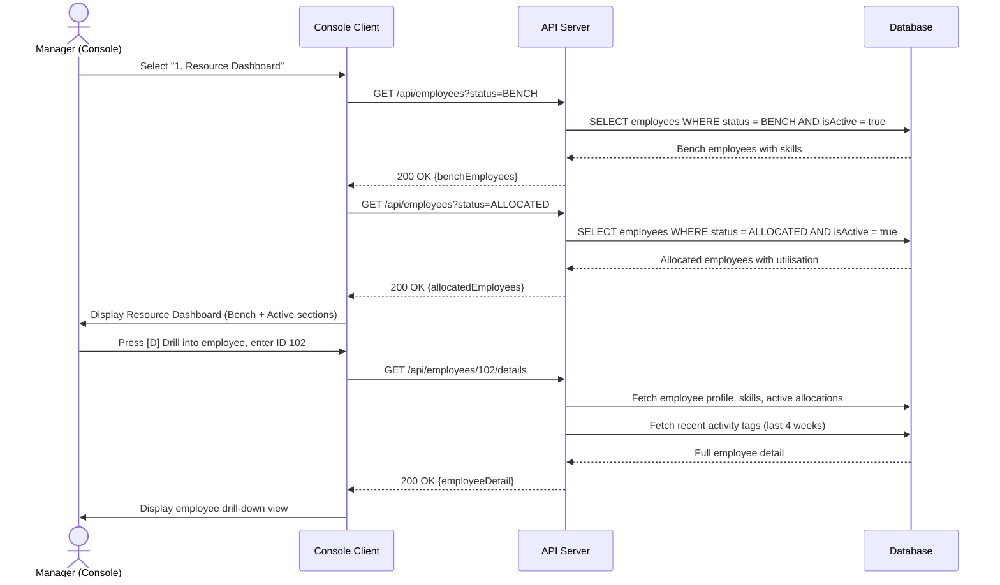
```mermaid
sequenceDiagram
    actor M as Manager (Console)
    participant C as Console Client
    participant S as API Server
    participant DB as Database

    M->>C: Select "1. Resource Dashboard"

    C->>S: GET /api/employees?status=BENCH
    S->>DB: SELECT employees WHERE status = BENCH AND isActive = true
    DB-->>S: Bench employees with skills
    S-->>C: 200 OK {benchEmployees}

    C->>S: GET /api/employees?status=ALLOCATED
    S->>DB: SELECT employees WHERE status = ALLOCATED AND isActive = true
    DB-->>S: Allocated employees with utilisation
    S-->>C: 200 OK {allocatedEmployees}

    C->>M: Display Resource Dashboard (Bench + Active sections)

    M->>C: Press [D] Drill into employee, enter ID 102

    C->>S: GET /api/employees/102/details
    S->>DB: Fetch employee profile, skills, active allocations
    S->>DB: Fetch recent activity tags (last 4 weeks)
    DB-->>S: Full employee detail
    S-->>C: 200 OK {employeeDetail}

    C->>M: Display employee drill-down view
```

#### Allocate Resource — AI-Assisted

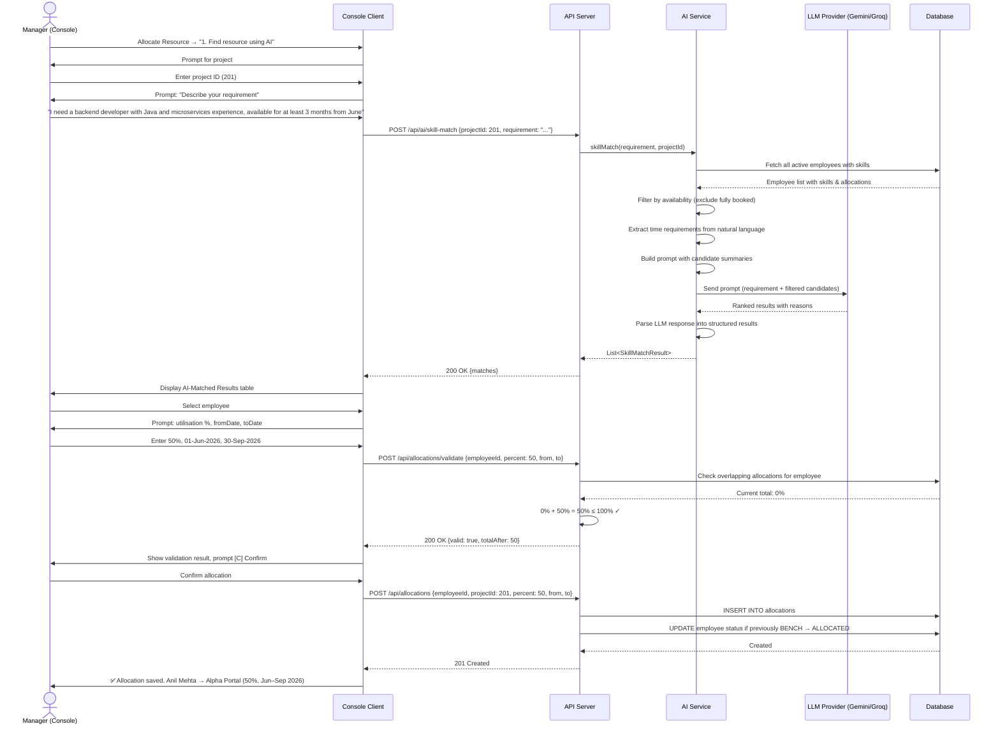
```mermaid
sequenceDiagram
    actor M as Manager (Console)
    participant C as Console Client
    participant S as API Server
    participant AI as AI Service
    participant LLM as LLM Provider (Gemini/Groq)
    participant DB as Database

    M->>C: Allocate Resource → "1. Find resource using AI"
    C->>M: Prompt for project
    M->>C: Enter project ID (201)

    C->>M: Prompt: "Describe your requirement"
    M->>C: "I need a backend developer with Java and microservices experience, available for at least 3 months from June"

    C->>S: POST /api/ai/skill-match {projectId: 201, requirement: "..."}

    S->>AI: skillMatch(requirement, projectId)
    AI->>DB: Fetch all active employees with skills
    DB-->>AI: Employee list with skills & allocations
    AI->>AI: Filter by availability (exclude fully booked)
    AI->>AI: Extract time requirements from natural language
    AI->>AI: Build prompt with candidate summaries
    AI->>LLM: Send prompt (requirement + filtered candidates)
    LLM-->>AI: Ranked results with reasons
    AI->>AI: Parse LLM response into structured results
    AI-->>S: List<SkillMatchResult>

    S-->>C: 200 OK {matches}
    C->>M: Display AI-Matched Results table

    M->>C: Select employee #1 (Anil Mehta)
    C->>M: Prompt: utilisation %, fromDate, toDate
    M->>C: Enter 50%, 01-Jun-2026, 30-Sep-2026

    C->>S: POST /api/allocations/validate {employeeId, percent: 50, from, to}
    S->>DB: Check overlapping allocations for employee
    DB-->>S: Current total: 0%
    S->>S: 0% + 50% = 50% ≤ 100% ✓
    S-->>C: 200 OK {valid: true, totalAfter: 50}

    C->>M: Show validation result, prompt [C] Confirm
    M->>C: Confirm allocation

    C->>S: POST /api/allocations {employeeId, projectId: 201, percent: 50, from, to}
    S->>DB: INSERT INTO allocations
    S->>DB: UPDATE employee status if previously BENCH → ALLOCATED
    DB-->>S: Created
    S-->>C: 201 Created
    C->>M: ✅ Allocation saved. Anil Mehta → Alpha Portal (50%, Jun–Sep 2026)
```

#### Allocate Resource — Direct (Skip AI)

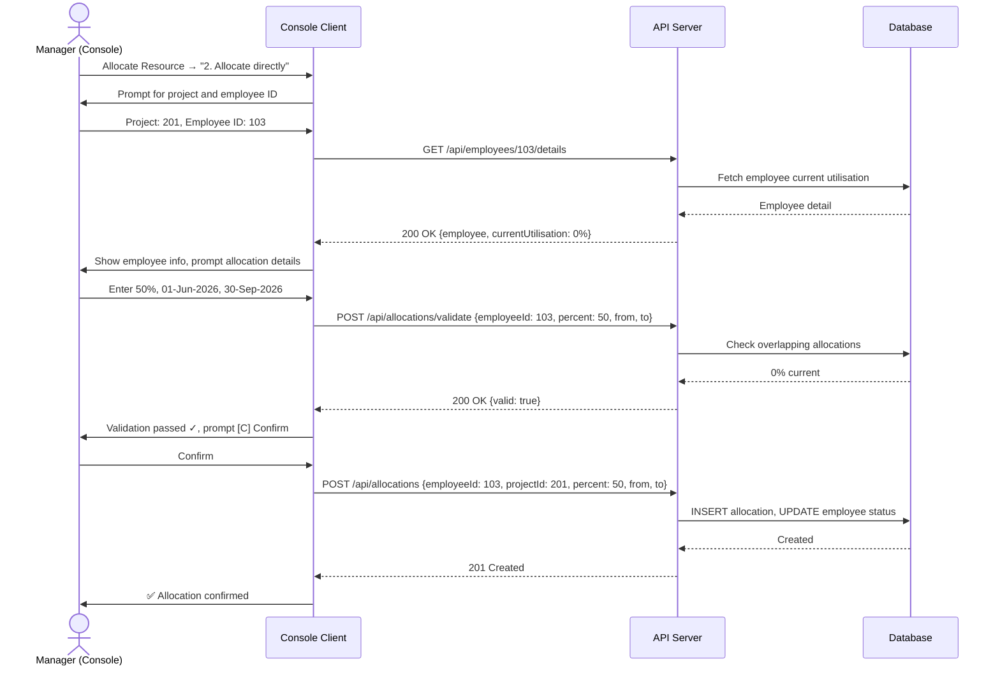
```mermaid
sequenceDiagram
    actor M as Manager (Console)
    participant C as Console Client
    participant S as API Server
    participant DB as Database

    M->>C: Allocate Resource → "2. Allocate directly"
    C->>M: Prompt for project and employee ID
    M->>C: Project: 201, Employee ID: 103

    C->>S: GET /api/employees/103/details
    S->>DB: Fetch employee current utilisation
    DB-->>S: Employee detail
    S-->>C: 200 OK {employee, currentUtilisation: 0%}

    C->>M: Show employee info, prompt allocation details
    M->>C: Enter 50%, 01-Jun-2026, 30-Sep-2026

    C->>S: POST /api/allocations/validate {employeeId: 103, percent: 50, from, to}
    S->>DB: Check overlapping allocations
    DB-->>S: 0% current
    S-->>C: 200 OK {valid: true}

    C->>M: Validation passed ✓, prompt [C] Confirm
    M->>C: Confirm

    C->>S: POST /api/allocations {employeeId: 103, projectId: 201, percent: 50, from, to}
    S->>DB: INSERT allocation, UPDATE employee status
    DB-->>S: Created
    S-->>C: 201 Created
    C->>M: ✅ Allocation confirmed
```

#### End an Existing Allocation

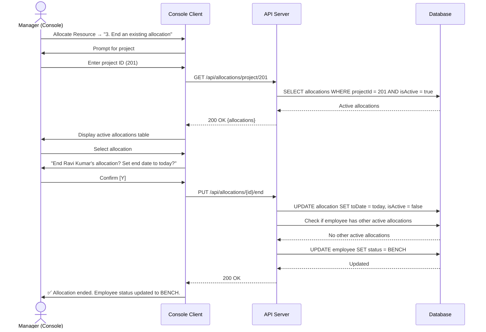
```mermaid
sequenceDiagram
    actor M as Manager (Console)
    participant C as Console Client
    participant S as API Server
    participant DB as Database

    M->>C: Allocate Resource → "3. End an existing allocation"
    C->>M: Prompt for project
    M->>C: Enter project ID (201)

    C->>S: GET /api/allocations/project/201
    S->>DB: SELECT allocations WHERE projectId = 201 AND isActive = true
    DB-->>S: Active allocations
    S-->>C: 200 OK {allocations}
    C->>M: Display active allocations table

    M->>C: Select allocation #1 (Ravi Kumar)
    C->>M: "End Ravi Kumar's allocation? Set end date to today?"

    M->>C: Confirm [Y]

    C->>S: PUT /api/allocations/{id}/end
    S->>DB: UPDATE allocation SET toDate = today, isActive = false
    S->>DB: Check if employee has other active allocations
    DB-->>S: No other active allocations
    S->>DB: UPDATE employee SET status = BENCH
    DB-->>S: Updated
    S-->>C: 200 OK
    C->>M: ✅ Allocation ended. Employee status updated to BENCH.
```

#### My Projects — View Health & AI Risk Summary

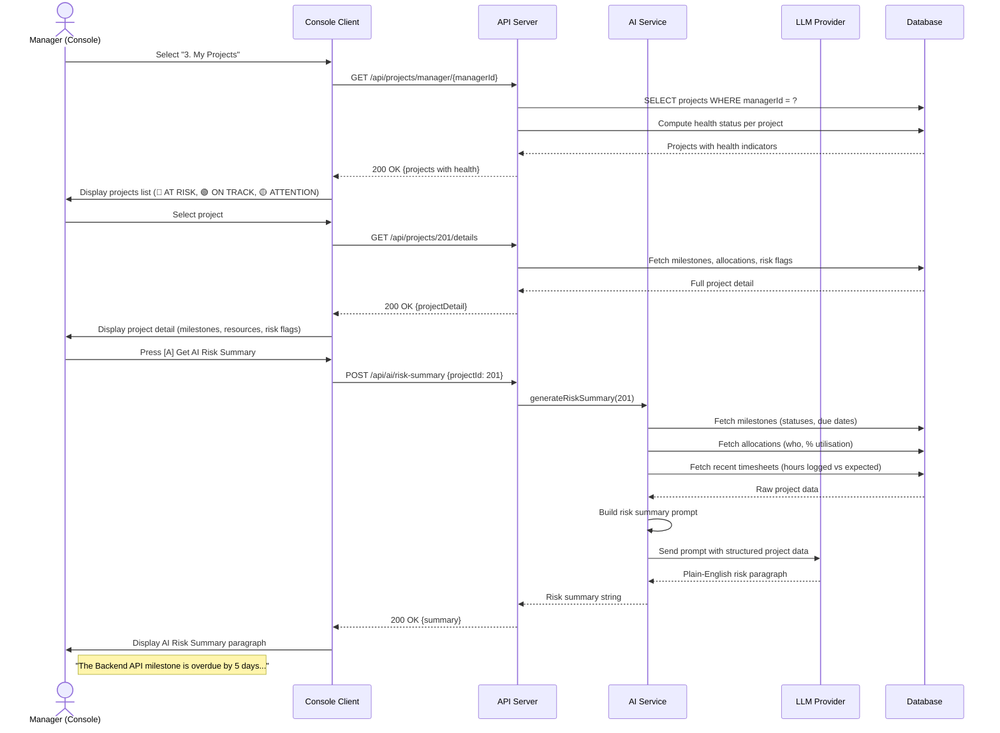
```mermaid
sequenceDiagram
    actor M as Manager (Console)
    participant C as Console Client
    participant S as API Server
    participant AI as AI Service
    participant LLM as LLM Provider
    participant DB as Database

    M->>C: Select "3. My Projects"

    C->>S: GET /api/projects/manager/{managerId}
    S->>DB: SELECT projects WHERE managerId = ?
    S->>DB: Compute health status per project
    DB-->>S: Projects with health indicators
    S-->>C: 200 OK {projects with health}
    C->>M: Display projects list (🔴 AT RISK, 🟢 ON TRACK, 🟡 ATTENTION)

    M->>C: Select project #1 (Alpha Portal)

    C->>S: GET /api/projects/201/details
    S->>DB: Fetch milestones, allocations, risk flags
    DB-->>S: Full project detail
    S-->>C: 200 OK {projectDetail}
    C->>M: Display project detail (milestones, resources, risk flags)

    M->>C: Press [A] Get AI Risk Summary

    C->>S: POST /api/ai/risk-summary {projectId: 201}
    S->>AI: generateRiskSummary(201)
    AI->>DB: Fetch milestones (statuses, due dates)
    AI->>DB: Fetch allocations (who, % utilisation)
    AI->>DB: Fetch recent timesheets (hours logged vs expected)
    DB-->>AI: Raw project data
    AI->>AI: Build risk summary prompt
    AI->>LLM: Send prompt with structured project data
    LLM-->>AI: Plain-English risk paragraph
    AI-->>S: Risk summary string

    S-->>C: 200 OK {summary}
    C->>M: Display AI Risk Summary paragraph
    Note right of M: "The Backend API milestone is overdue by 5 days..."
```

#### View Team Timesheets (Manager)

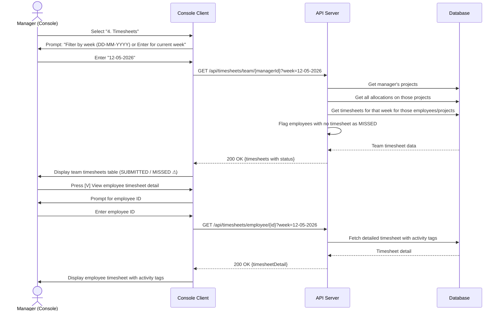
```mermaid
sequenceDiagram
    actor M as Manager (Console)
    participant C as Console Client
    participant S as API Server
    participant DB as Database

    M->>C: Select "4. Timesheets"
    C->>M: Prompt: "Filter by week (DD-MM-YYYY) or Enter for current week"
    M->>C: Enter "12-05-2026"

    C->>S: GET /api/timesheets/team/{managerId}?week=12-05-2026
    S->>DB: Get manager's projects
    S->>DB: Get all allocations on those projects
    S->>DB: Get timesheets for that week for those employees/projects
    S->>S: Flag employees with no timesheet as MISSED
    DB-->>S: Team timesheet data
    S-->>C: 200 OK {timesheets with status}

    C->>M: Display team timesheets table (SUBMITTED / MISSED ⚠)

    M->>C: Press [V] View employee timesheet detail
    C->>M: Prompt for employee ID
    M->>C: Enter employee ID

    C->>S: GET /api/timesheets/employee/{id}?week=12-05-2026
    S->>DB: Fetch detailed timesheet with activity tags
    DB-->>S: Timesheet detail
    S-->>C: 200 OK {timesheetDetail}
    C->>M: Display employee timesheet with activity tags
```

---

### Employee Flows

#### Submit Weekly Timesheet

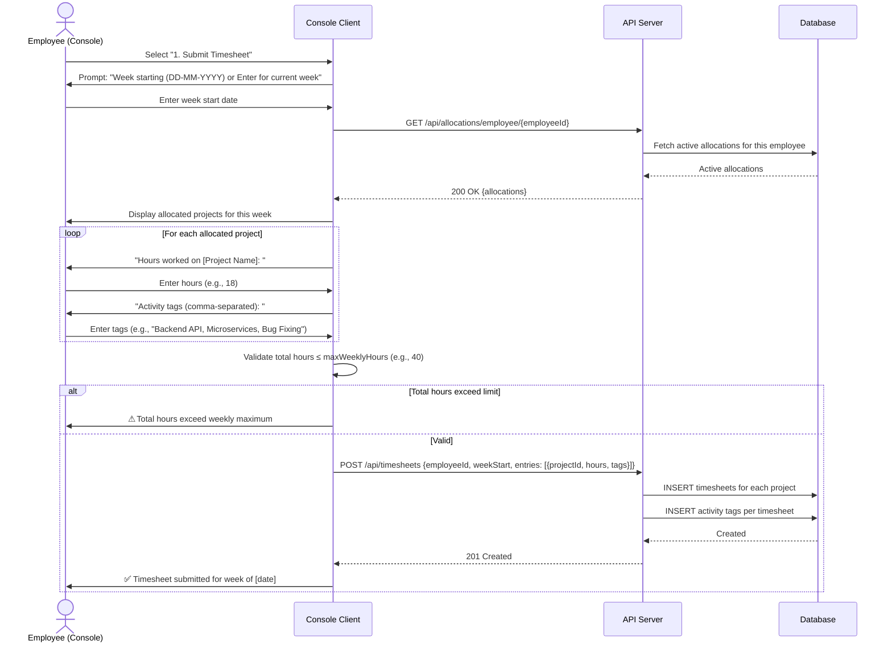
```mermaid
sequenceDiagram
    actor E as Employee (Console)
    participant C as Console Client
    participant S as API Server
    participant DB as Database

    E->>C: Select "1. Submit Timesheet"
    C->>E: Prompt: "Week starting (DD-MM-YYYY) or Enter for current week"
    E->>C: Enter week start date

    C->>S: GET /api/allocations/employee/{employeeId}
    S->>DB: Fetch active allocations for this employee
    DB-->>S: Active allocations
    S-->>C: 200 OK {allocations}

    C->>E: Display allocated projects for this week

    loop For each allocated project
        C->>E: "Hours worked on [Project Name]: "
        E->>C: Enter hours (e.g., 18)
        C->>E: "Activity tags (comma-separated): "
        E->>C: Enter tags (e.g., "Backend API, Microservices, Bug Fixing")
    end

    C->>C: Validate total hours ≤ maxWeeklyHours (e.g., 40)

    alt Total hours exceed limit
        C->>E: ⚠ Total hours exceed weekly maximum
    else Valid
        C->>S: POST /api/timesheets {employeeId, weekStart, entries: [{projectId, hours, tags}]}
        S->>DB: INSERT timesheets for each project
        S->>DB: INSERT activity tags per timesheet
        DB-->>S: Created
        S-->>C: 201 Created
        C->>E: ✅ Timesheet submitted for week of [date]
    end
```

#### View Allocation History

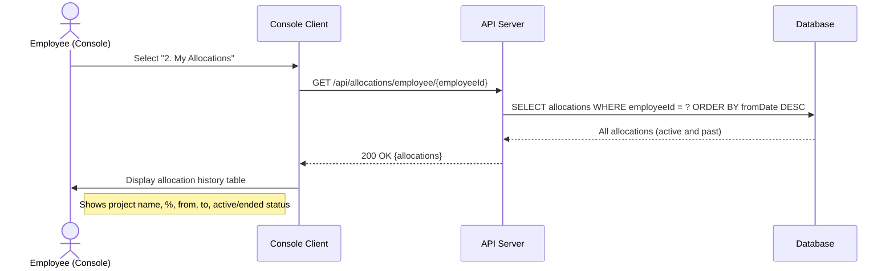
```mermaid
sequenceDiagram
    actor E as Employee (Console)
    participant C as Console Client
    participant S as API Server
    participant DB as Database

    E->>C: Select "2. My Allocations"

    C->>S: GET /api/allocations/employee/{employeeId}
    S->>DB: SELECT allocations WHERE employeeId = ? ORDER BY fromDate DESC
    DB-->>S: All allocations (active and past)
    S-->>C: 200 OK {allocations}

    C->>E: Display allocation history table
    Note right of E: Shows project name, %, from, to, active/ended status
```

#### View Timesheet History

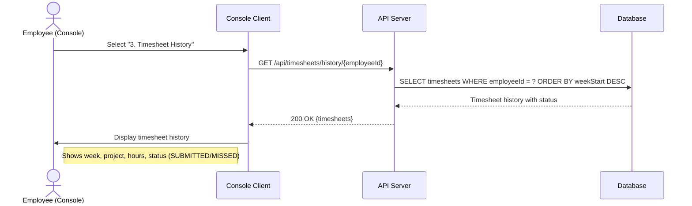
```mermaid
sequenceDiagram
    actor E as Employee (Console)
    participant C as Console Client
    participant S as API Server
    participant DB as Database

    E->>C: Select "3. Timesheet History"

    C->>S: GET /api/timesheets/history/{employeeId}
    S->>DB: SELECT timesheets WHERE employeeId = ? ORDER BY weekStart DESC
    DB-->>S: Timesheet history with status
    S-->>C: 200 OK {timesheets}

    C->>E: Display timesheet history
    Note right of E: Shows week, project, hours, status (SUBMITTED/MISSED)
```

---

### Background Scheduler

#### Utilisation Update & Health Flagging

```mermaid
sequenceDiagram
    participant SCH as Background Scheduler
    participant SVC as Scheduler Service
    participant DB as Database

    Note over SCH: Runs every N hours (configurable in System Config)

    SCH->>SVC: runUtilisationUpdate()

    SVC->>DB: SELECT all active allocations
    DB-->>SVC: Active allocation list

    loop For each employee with allocations
        SVC->>SVC: Sum overlapping allocation percentages
        alt Total > 0%
            SVC->>DB: UPDATE employee SET status = ALLOCATED
        else Total = 0%
            SVC->>DB: UPDATE employee SET status = BENCH
        end
    end

    Note over SCH: --- Health Flagging Phase ---

    SCH->>SVC: runHealthFlagging()

    SVC->>DB: SELECT all active projects with milestones
    DB-->>SVC: Projects + milestones

    loop For each active project
        SVC->>SVC: Check for overdue milestones (dueDate < today AND status ≠ DONE)
        SVC->>DB: Get recent timesheets for project
        DB-->>SVC: Timesheet data
        SVC->>SVC: Compare logged hours vs expected hours
        SVC->>SVC: Check for employees with MISSED timesheets

        alt Overdue milestones OR significant hour shortfall
            SVC->>SVC: Flag project as AT_RISK 🔴
        else Minor concerns (approaching deadline, slight shortfall)
            SVC->>SVC: Flag project as NEEDS_ATTENTION 🟡
        else All milestones on track, hours normal
            SVC->>SVC: Flag project as ON_TRACK 🟢
        end

        SVC->>DB: UPDATE project health status
    end

    SVC-->>SCH: Scheduler cycle complete
```

---

### AI Flows

#### AI Skill Match — Full-Time Request

```mermaid
sequenceDiagram
    participant S as API Server
    participant AI as AI Service
    participant DB as Database
    participant PB as Prompt Builder
    participant LLM as LLM Provider

    S->>AI: skillMatch("Java + microservices developer, 3 months from June", projectId=201)

    AI->>DB: SELECT employees with skills, allocations, status
    DB-->>AI: All active employees

    AI->>AI: Filter: exclude fully booked (utilisation = 100%)
    AI->>AI: Filter: only employees available in requested period
    Note right of AI: Candidates reduced from 10 → 4

    AI->>DB: SELECT recent activity tags for candidates (last 4 weeks)
    DB-->>AI: Activity tag data

    AI->>PB: buildSkillMatchPrompt(requirement, candidates)
    PB-->>AI: Formatted prompt string

    Note right of PB: Prompt includes:<br/>- Manager's requirement text<br/>- Each candidate's skills, free %, department<br/>- Recent activity tags<br/>- Instructions to rank and explain

    AI->>LLM: sendPrompt(formattedPrompt)
    LLM-->>AI: JSON/structured response with rankings

    AI->>AI: parseSkillMatchResponse(llmResponse)
    AI-->>S: List<SkillMatchResult>
```

#### AI Skill Match — Part-Time / Limited Hours

```mermaid
sequenceDiagram
    participant S as API Server
    participant AI as AI Service
    participant DB as Database
    participant PB as Prompt Builder
    participant LLM as LLM Provider

    S->>AI: skillMatch("10 hrs/week for UI testing", projectId=201)

    AI->>AI: extractHoursFromNaturalLanguage("10 hrs/week for UI testing")
    Note right of AI: Extracted: 10 hours/week

    AI->>DB: SELECT employees with skills, allocations
    DB-->>AI: All active employees

    AI->>AI: Calculate free hours per employee
    Note right of AI: freeHours = (100% - currentUtil%) × maxWeeklyHours / 100

    AI->>AI: Filter: only employees with ≥ 10 free hours/week
    Note right of AI: e.g., Priya: 40 free hrs, Neha: 10 free hrs

    alt No candidates qualify
        AI-->>S: Empty list + message "No employees available"
    else Candidates found
        AI->>DB: SELECT recent activity tags for candidates
        DB-->>AI: Activity data

        AI->>PB: buildPartialHoursPrompt(requirement, candidates, 10)
        PB-->>AI: Formatted prompt with hours context

        AI->>LLM: sendPrompt(formattedPrompt)
        LLM-->>AI: Ranked results with suggested allocation %

        AI->>AI: Parse response, compute suggestedAllocationPercent
        Note right of AI: 10 hrs / 40 maxWeekly × 100 = 25%

        AI-->>S: List<SkillMatchResult> with suggested %
    end
```

#### AI Risk Summary — Full Pipeline

```mermaid
sequenceDiagram
    participant S as API Server
    participant AI as AI Service
    participant DB as Database
    participant PB as Prompt Builder
    participant LLM as LLM Provider

    S->>AI: generateRiskSummary(projectId=201)

    AI->>DB: SELECT project details (name, dates, status)
    DB-->>AI: Project: Alpha Portal, ends 30-Jun-26, ACTIVE

    AI->>DB: SELECT milestones for project 201
    DB-->>AI: 4 milestones (1 DONE, 1 IN_PROGRESS overdue, 2 NOT_STARTED)

    AI->>DB: SELECT allocations for project 201
    DB-->>AI: 2 employees (Ravi 50%, Neha 50%)

    AI->>DB: SELECT timesheets for project 201 (last 2-4 weeks)
    DB-->>AI: Ravi: 4 hrs last week (expected ~20), Neha: 20 hrs ✓

    AI->>AI: Compute factual summary
    Note right of AI: Facts:<br/>- Backend API milestone 5 days overdue<br/>- Ravi logged 4/20 expected hours<br/>- Testing not started, due in 2 weeks<br/>- Go-live in 6 weeks

    AI->>PB: buildRiskSummaryPrompt(milestones, allocations, timesheets)
    PB-->>AI: Prompt with structured facts + instruction

    AI->>LLM: sendPrompt(formattedPrompt)
    LLM-->>AI: Plain-English risk paragraph

    AI-->>S: "The Backend API milestone is at risk of delay..."
```

---

## Entity Relationship Summary

```mermaid
erDiagram
    USER ||--o| EMPLOYEE : "has profile"
    USER ||--o{ PROJECT : "manages (if Manager)"
    EMPLOYEE ||--o{ SKILL : "possesses"
    EMPLOYEE ||--o{ ALLOCATION : "is allocated"
    EMPLOYEE ||--o{ TIMESHEET : "submits"
    PROJECT ||--o{ MILESTONE : "contains"
    PROJECT ||--o{ ALLOCATION : "staffed by"
    PROJECT ||--o{ TIMESHEET : "logged against"
    TIMESHEET ||--o{ ACTIVITY_TAG : "tagged with"

    USER {
        int id PK
        string fullName
        string email UK
        string username UK
        string passwordHash
        enum role
        bool isActive
        bool forcePasswordChange
    }

    EMPLOYEE {
        int id PK
        int userId FK
        string fullName
        string email
        string department
        string designation
        enum status
        bool isActive
    }

    SKILL {
        int id PK
        int employeeId FK
        string skillName
        enum category
        enum proficiency
    }

    PROJECT {
        int id PK
        string name
        string description
        date startDate
        date endDate
        enum status
        int managerId FK
        enum healthStatus
    }

    MILESTONE {
        int id PK
        int projectId FK
        string title
        date dueDate
        enum status
    }

    ALLOCATION {
        int id PK
        int employeeId FK
        int projectId FK
        int utilisationPercent
        date fromDate
        date toDate
        bool isActive
    }

    TIMESHEET {
        int id PK
        int employeeId FK
        int projectId FK
        date weekStartDate
        decimal hoursLogged
        enum status
    }

    ACTIVITY_TAG {
        int id PK
        int timesheetId FK
        string tagName
    }

    SYSTEM_CONFIG {
        int id PK
        string llmProvider
        string llmApiKey
        int schedulerIntervalHours
        int maxWeeklyHours
    }
```

---

## Console Navigation Flow

High-level view of how screens connect and what each role can access.

```mermaid
flowchart TB
    START["🚀 Application Start"]
    LOGIN["Login Screen"]
    SIGNUP["Sign Up Screen"]
    CHGPWD["Change Password (forced)"]

    START --> LOGIN
    START --> SIGNUP
    SIGNUP --> LOGIN

    LOGIN -->|"Admin"| ADMIN_MENU
    LOGIN -->|"Manager"| MGR_MENU
    LOGIN -->|"Employee"| EMP_MENU
    LOGIN -->|"Force Change"| CHGPWD
    CHGPWD --> LOGIN

    subgraph ADMIN["Admin Panel"]
        ADMIN_MENU["Admin Menu"]
        ME["Manage Employees"]
        MP["Manage Projects"]
        VA["View All Allocations"]
        MU["Manage Users"]
        SC["System Configuration"]

        ADMIN_MENU --> ME
        ADMIN_MENU --> MP
        ADMIN_MENU --> VA
        ADMIN_MENU --> MU
        ADMIN_MENU --> SC

        ME --> ME_ADD["Add Employee"]
        ME --> ME_VIEW["View All Employees"]
        ME --> ME_UPD["Update Employee"]
        ME --> ME_DEACT["Deactivate Employee"]
        ME --> ME_SKILL["Manage Skills"]

        MP --> MP_CREATE["Create Project"]
        MP --> MP_VIEW["View All Projects"]
        MP --> MP_UPD["Update Project"]
        MP --> MP_MILE["Manage Milestones"]

        MU --> MU_CREATE["Create User Account"]
        MU --> MU_VIEW["View All Users"]
        MU --> MU_RESET["Reset Password"]
        MU --> MU_DEACT["Deactivate User"]
    end

    subgraph MANAGER["Manager Panel"]
        MGR_MENU["Manager Menu"]
        RD["Resource Dashboard"]
        AR["Allocate Resource"]
        MYPROJ["My Projects"]
        TS["Timesheets"]
        AIAST["AI Assistant"]

        MGR_MENU --> RD
        MGR_MENU --> AR
        MGR_MENU --> MYPROJ
        MGR_MENU --> TS
        MGR_MENU --> AIAST

        AR --> AR_AI["AI-Assisted Search"]
        AR --> AR_DIR["Direct Allocation"]
        AR --> AR_END["End Allocation"]

        AIAST --> AI_SKILL["Skill Match"]
        AIAST --> AI_RISK["Risk Summary"]
    end

    subgraph EMPLOYEE["Employee Panel"]
        EMP_MENU["Employee Menu"]
        SUB_TS["Submit Timesheet"]
        MY_ALLOC["My Allocations"]
        TS_HIST["Timesheet History"]

        EMP_MENU --> SUB_TS
        EMP_MENU --> MY_ALLOC
        EMP_MENU --> TS_HIST
    end
```
