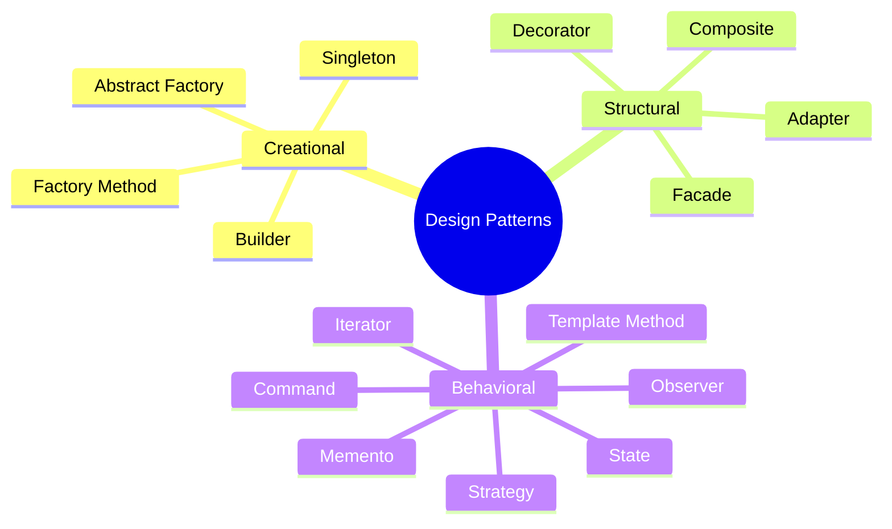

# 🧩 Design Patterns — C#

A hands-on reference repository of **15 classic Gang of Four (GoF) design patterns** implemented in C#. Each pattern includes a real-world exercise, a UML diagram, and documented use cases — built to serve as a personal reference and learning record.

---

## 📂 Repository Structure

```
DesignPatterns/
├── Creational/
│   ├── Singleton/
│   ├── Factory/
│   ├── AbstractFactory/
│   └── Builder/
├── Structural/
│   ├── Adapter/
│   ├── Composite/
│   ├── Decorator/
│   └── Facade/
└── Behavioral/
    ├── Command/
    ├── Iterator/
    ├── Memento/
    ├── Observer/
    ├── State/
    ├── Strategy/
    └── TemplateMethod/
```

---

## 🏗️ Creational Patterns
> Deal with **object creation** mechanisms, aiming to create objects in a manner suitable to the situation.

| Pattern | Intent | Real-World Exercise |
|---|---|---|
| [Singleton](./Creational/Singleton/README.md) | Ensure only one instance exists with a global access point | Counter shared across the application |
| [Factory Method](./Creational/Factory/README.md) | Let subclasses decide which object to instantiate | Shape drawing system (Triangle, Circle, Rectangle) |
| [Abstract Factory](./Creational/AbstractFactory/README.md) | Create families of related objects without specifying concrete classes | UI theming system (Light & Dark theme colors and fonts) |
| [Builder](./Creational/Builder/README.md) | Construct complex objects step by step | Email builder with optional CC, BCC, attachments |

---

## 🏛️ Structural Patterns
> Deal with **object composition**, creating relationships between objects to form larger structures.

| Pattern | Intent | Real-World Exercise |
|---|---|---|
| [Adapter](./Structural/Adapter/README.md) | Convert an interface into another interface clients expect | Fahrenheit sensor adapted to Celsius thermometer interface |
| [Composite](./Structural/Composite/README.md) | Treat individual objects and compositions uniformly | Restaurant menu system with items and submenus |
| [Decorator](./Structural/Decorator/README.md) | Add responsibilities to objects dynamically by wrapping them | Pizza topping system with stackable decorators |
| [Facade](./Structural/Facade/README.md) | Provide a simplified interface to a complex subsystem | Smart home controller for lights, thermostat, and security |

---

## 🔄 Behavioral Patterns
> Deal with **communication and responsibility** between objects.

| Pattern | Intent | Real-World Exercise |
|---|---|---|
| [Command](./Behavioral/Command/README.md) | Encapsulate a request as an object to support undo/queue | Restaurant order system with waiter, kitchen, and undo |
| [Iterator](./Behavioral/Iterator/README.md) | Access collection elements without exposing internal structure | Reverse playlist iterator |
| [Memento](./Behavioral/Memento/README.md) | Capture and restore an object's internal state | Game save/load system with health, level, and position |
| [Observer](./Behavioral/Observer/README.md) | Notify multiple dependents when an object changes state | Weather station broadcasting to multiple displays |
| [State](./Behavioral/State/README.md) | Alter object behaviour when its internal state changes | Traffic light cycling through Red → Green → Yellow |
| [Strategy](./Behavioral/Strategy/README.md) | Encapsulate interchangeable algorithms and swap at runtime | Text formatter switching between Upper, Lower, Title case |
| [Template Method](./Behavioral/TemplateMethod/README.md) | Define an algorithm skeleton; let subclasses override steps | Beverage maker with fixed steps but custom brew/condiments |

---

## 🧠 Pattern Relationships at a Glance



---

## 🔑 Quick Decision Guide

| Situation | Use This Pattern |
|---|---|
| Need exactly one instance globally | **Singleton** |
| Subclass should decide which object to create | **Factory Method** |
| Need families of related objects to stay compatible | **Abstract Factory** |
| Object needs many optional config steps | **Builder** |
| Two incompatible interfaces need to work together | **Adapter** |
| Single objects and groups need the same interface | **Composite** |
| Add features to an object without changing its class | **Decorator** |
| Simplify a complex set of subsystem calls | **Facade** |
| Need undo, queue, or log operations | **Command** |
| Traverse a collection without exposing its internals | **Iterator** |
| Need to save and restore object state | **Memento** |
| Many objects need to react to one object's changes | **Observer** |
| Object behaviour changes based on its state | **State** |
| Switch algorithms at runtime | **Strategy** |
| Fixed algorithm steps, but some steps vary | **Template Method** |

---

## 🛠️ Tech Stack

- **Language:** C# (.NET)
- **IDE:** Visual Studio
- **Diagrams:** Mermaid (rendered natively by GitHub)

---

## 📖 References

- *Design Patterns: Elements of Reusable Object-Oriented Software* — Gang of Four (GoF)
- [Refactoring Guru — Design Patterns](https://refactoring.guru/design-patterns)